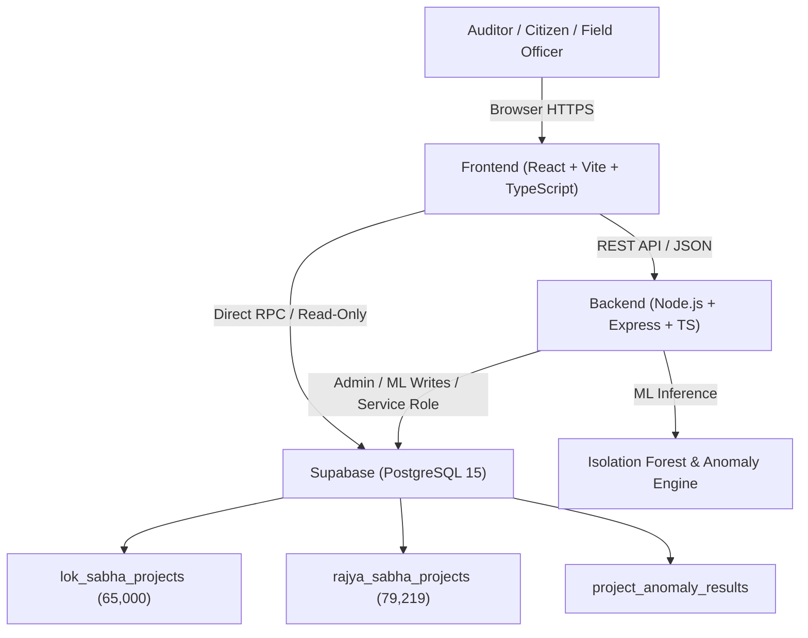

# MPLADS Sentinel — System Architecture

## Overview

MPLADS Sentinel is a national intelligence, geospatial tracking, and anomaly detection platform for the Member of Parliament Local Area Development Scheme (MPLADS). It processes 144,219 official government project records across India to detect irregularities, cost anomalies, stagnant projects, and disbursement mismatches.

## Layer Separation

### 1. Frontend (`frontend/`)
- Built with React 18, Vite, TypeScript, and Tailwind CSS.
- Global state managed by Zustand (`frontend/src/store/store.ts`).
- Responsive administrative layout (`MainLayout.tsx`) with TopBar, Sidebar, and OfficialFilterBar.
- Interactive GIS Mapping via Leaflet & React-Leaflet with optimized GeoJSON boundaries for all 543 Parliamentary Constituencies and 36 States/UTs.
- Completely decouples data parsing from the client bundle, eliminating static CSV imports and reducing client payload by over 95%.

### 2. Backend (`backend/`)
- Node.js & Express REST API with TypeScript strict type safety.
- Machine Learning Layer (`backend/src/ml/isolationForest.ts`): Implements an unsupervised ensemble of isolation trees to identify multi-dimensional outliers with transparent feature attribution.
- Risk Engine (`backend/src/risk/riskEngine.ts`): Evaluates deterministic operational risk factors (stale milestones, prolonged pending recommendations, disbursement mismatches).
- Anomaly Engine (`backend/src/anomaly/`): TF-IDF + Cosine similarity duplicate detection scoped to constituency and category buckets.
- Strict House Isolation middleware (`backend/src/middleware/validation.ts`): Guarantees Lok Sabha and Rajya Sabha records are never conflated or cross-queried.

### 3. Database (`database/`)
- Hosted PostgreSQL on Supabase with dedicated indexed tables:
  - `lok_sabha_projects`: 65,000 project records
  - `rajya_sabha_projects`: 79,219 project records
  - `project_anomaly_results`: Cached explainable anomaly scores with risk factors
- Server-side PostgreSQL Stored Procedures (RPCs):
  - `get_dashboard_kpis`: Fast aggregation of total amounts, completion rates, and risk counts.
  - `get_distinct_filter_options`: High-speed distinct value extraction for filter dropdowns.
  - `get_constituency_gis_metrics`: Geospatial aggregation by Parliamentary Constituency.
  - `get_state_gis_metrics`: Geospatial aggregation by State/UT.
  - `get_dataset_anomaly_counts`: Fast dataset-wide tally of anomaly indicators.
- Row-Level Security (RLS): Read-only anonymous access for public transparency, authenticated role protection for modifications.

## Security Architecture

1. **Least Privilege Credentials**:
   - Frontend accesses Supabase strictly using publishable anonymous keys (`VITE_SUPABASE_PUBLISHABLE_KEY`).
   - Backend utilizes server-side environment variables and never exposes service role keys to clients.
2. **Export Guard**:
   - The application enforces a strict safety guard requiring user-defined filter selection prior to batch data extraction, preventing accidental full-database dumps.
3. **House Isolation Invariant**:
   - Lok Sabha (elected by constituency) and Rajya Sabha (nominated/elected by state) data structures maintain distinct schemas and strict query isolation across all layers.
