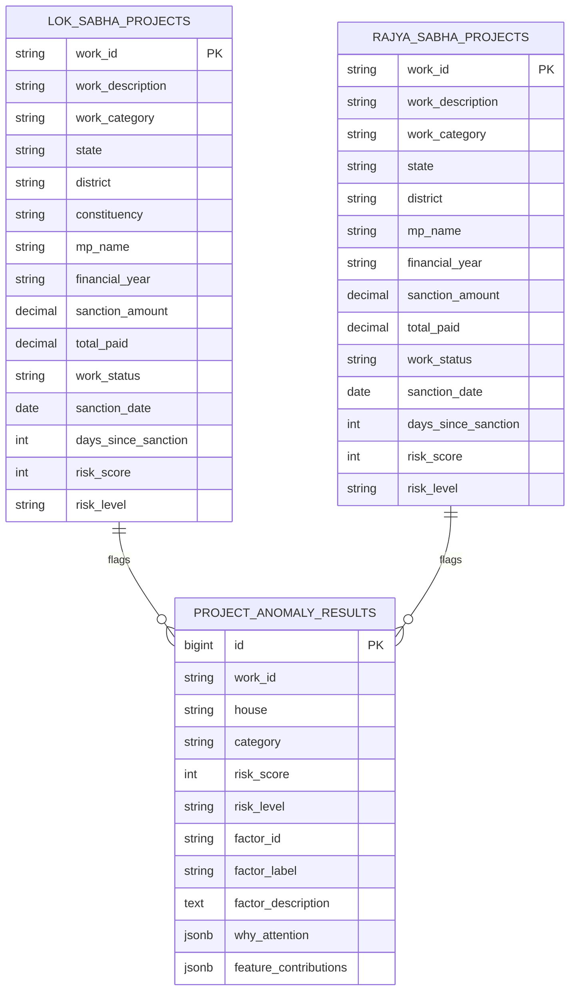

# MPLADS Sentinel — Data Model Documentation

## Entity Overview

The MPLADS Sentinel data model represents project life-cycles, financial disbursements, geographic regions, and automated risk scoring across two Indian Parliamentary chambers.

## Table Specifications

### 1. `lok_sabha_projects` (65,000 Rows)
Primary table containing projects recommended and sanctioned under the Lok Sabha.

| Column | Type | Description |
|---|---|---|
| `work_id` | `VARCHAR(100)` | Unique project identifier (Primary Key) |
| `sr_no` | `VARCHAR(50)` | Sequential record serial number |
| `work_category` | `VARCHAR(255)` | Sectoral category (Roads, Drinking Water, Education, etc.) |
| `state` | `VARCHAR(100)` | State or Union Territory name |
| `ida` | `VARCHAR(255)` | Implementing District Authority |
| `district` | `VARCHAR(100)` | Administrative district |
| `mp_name` | `VARCHAR(255)` | Member of Parliament name |
| `constituency` | `VARCHAR(255)` | Parliamentary Constituency |
| `work_description`| `TEXT` | Detailed project scope and title |
| `financial_year` | `VARCHAR(50)` | Financial year of sanction (e.g. 2024-2025) |
| `recommended_date`| `DATE` | Date MP recommended project |
| `sanction_date` | `DATE` | Date district collector issued administrative sanction |
| `completion_date` | `DATE` | Date project physical completion certificate was registered |
| `expenditure_date` | `DATE` | Date of last registered disbursement |
| `sanction_amount` | `NUMERIC(15,2)` | Budget ceiling sanctioned (INR) |
| `recommended_amount` | `NUMERIC(15,2)` | Budget recommended by MP (INR) |
| `amount_disbursed`| `NUMERIC(15,2)` | Disbursed amount from completed works record |
| `expenditure_amount`| `NUMERIC(15,2)` | Expenditure from cumulative spending ledger |
| `total_paid` | `NUMERIC(15,2)` | Resolved total public funds released |
| `allocated_limit` | `NUMERIC(15,2)` | Total MP scheme allocation ceiling |
| `disbursement_ratio` | `NUMERIC(8,2)` | `(total_paid / sanction_amount) * 100` |
| `work_status` | `VARCHAR(100)` | Milestone: Sanction, Vendor Identification, Work In Progress, Physical Inspection, Work Completed |
| `paymentStatus` | `VARCHAR(100)` | Payment status ledger |
| `is_completed` | `BOOLEAN` | Boolean flag for fast completion counting |
| `is_sanctioned` | `BOOLEAN` | Boolean flag for sanctioned vs recommendation-only |
| `days_since_sanction` | `INT` | Days elapsed since administrative sanction |
| `risk_score` | `INT` | Aggregated risk index (0 - 100) |
| `risk_level` | `VARCHAR(20)` | Classification: `LOW`, `MEDIUM`, `HIGH` |
| `risk_factors` | `JSONB` | Structured breakdown of risk contributors |

### 2. `rajya_sabha_projects` (79,219 Rows)
Dedicated table for Upper House projects. Follows identical schema semantics to `lok_sabha_projects`, preserving strict state representation without artificial constituency constraints.

### 3. `project_anomaly_results`
Caching table for high-risk outlier candidates generated by statistical rule checks and Isolation Forest machine learning analysis.
